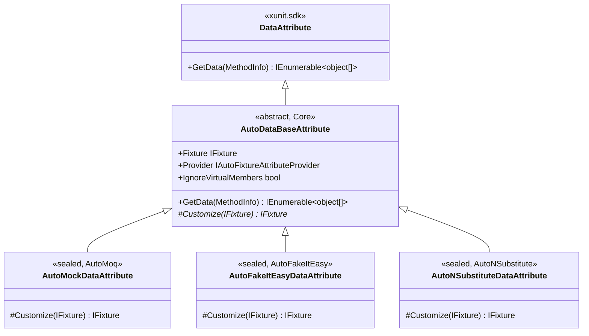
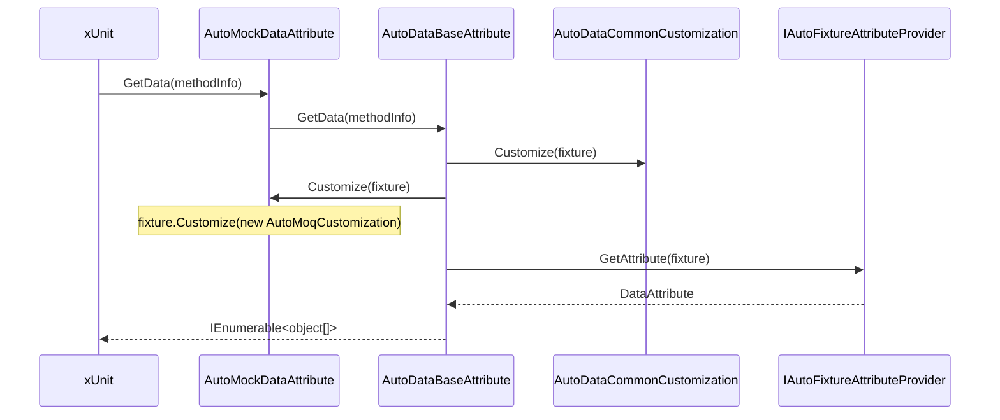
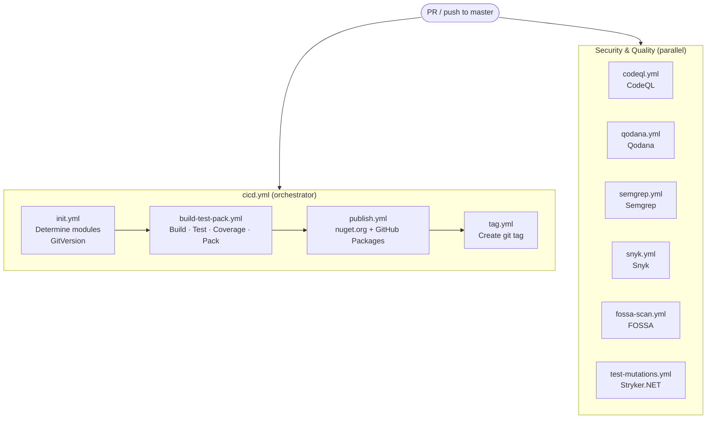

# AGENTS.md — AI Agent Context for AutoFixture.XUnit2.AutoMock

This file provides context for AI coding assistants (Claude Code, GitHub Copilot, OpenAI Codex,
Cursor, and others) working in this repository. Read it before making any changes.

---

## What This Project Does

This is a **C# NuGet library collection** that bridges two testing libraries:

- **[AutoFixture](https://github.com/AutoFixture/AutoFixture)** — generates anonymous test data automatically
- **Mocking frameworks** — Moq, FakeItEasy, NSubstitute

The result: xUnit2 test attributes that auto-generate both test data *and* mocks in one step,
eliminating boilerplate setup in unit tests.

**Published NuGet packages:**

- `Objectivity.AutoFixture.XUnit2.AutoMoq` (uses Moq)
- `Objectivity.AutoFixture.XUnit2.AutoFakeItEasy` (uses FakeItEasy)
- `Objectivity.AutoFixture.XUnit2.AutoNSubstitute` (uses NSubstitute)

`Core` is **not published standalone** — it is bundled into each of the three packages above.

---

## Repository Layout

```text
├── AGENTS.md                         # This file
├── README.md                         # Public-facing documentation with usage examples
├── GitVersion.yml                    # Semantic versioning (ContinuousDelivery mode)
├── stryker-config.yml                # Mutation testing configuration
├── images/                           # Package icon
└── src/
    ├── Objectivity.AutoFixture.XUnit2.AutoMock.sln        # Primary solution (all 8 projects)
    ├── Objectivity.AutoFixture.XUnit2.AutoFakeItEasy.sln  # FakeItEasy-specific solution
    ├── Objectivity.AutoFixture.XUnit2.AutoMoq.sln         # Moq-specific solution
    ├── Objectivity.AutoFixture.XUnit2.AutoNSubstitute.sln # NSubstitute-specific solution
    ├── Objectivity.AutoFixture.XUnit2.Core.sln            # Core-only solution
    ├── Directory.Build.props         # Shared MSBuild properties (company, version defaults)
    ├── .editorconfig                 # Code style enforcement for the entire src/ tree
    ├── CodeAnalysisDictionary.xml    # Custom word list for FxCop/spell-check analyzers
    ├── qodana.yaml                   # JetBrains Qodana static analysis config
    ├── public.snk                    # Public strong-name signing key (delay-signed locally)
    │
    ├── Objectivity.AutoFixture.XUnit2.Core/               # Shared infrastructure (not published)
    │   ├── Attributes/               # AutoDataBaseAttribute + all parameter attributes
    │   ├── Common/                   # Guard extensions (NotNull, etc.)
    │   ├── Comparers/                # Custom equality comparers
    │   ├── Customizations/           # AutoDataCommonCustomization and others
    │   ├── Factories/                # IFixture factory abstraction and others
    │   ├── MemberData/               # MemberAutoData extenders
    │   ├── Providers/                # Provider abstractions and others
    │   ├── Requests/                 # AutoFixture specimen request types
    │   └── SpecimenBuilders/         # Custom AutoFixture specimen builders
    │
    ├── Objectivity.AutoFixture.XUnit2.Core.Tests/
    ├── Objectivity.AutoFixture.XUnit2.AutoMoq/
    │   └── Attributes/               # AutoMockDataAttribute,
    |                                 # InlineAutoMockDataAttribute,
    │                                 # MemberAutoMockDataAttribute
    ├── Objectivity.AutoFixture.XUnit2.AutoMoq.Tests/
    ├── Objectivity.AutoFixture.XUnit2.AutoFakeItEasy/
    ├── Objectivity.AutoFixture.XUnit2.AutoFakeItEasy.Tests/
    ├── Objectivity.AutoFixture.XUnit2.AutoNSubstitute/
    └── Objectivity.AutoFixture.XUnit2.AutoNSubstitute.Tests/
```

---

## Build, Test, and Pack Commands

All commands run from the **repository root** unless specified otherwise.
CI runs on **Windows** because `net472`/`net48` require it.

```bash
# Build entire solution
dotnet build src/Objectivity.AutoFixture.XUnit2.AutoMock.sln

# Run all tests (all framework slices: net8.0, net472, net48 on Windows)
dotnet test src/Objectivity.AutoFixture.XUnit2.AutoMock.sln

# Run tests for a specific module only
dotnet test src/Objectivity.AutoFixture.XUnit2.AutoMoq.sln

# Run tests for a specific framework
dotnet test src/Objectivity.AutoFixture.XUnit2.AutoMock.sln --framework net8.0

# Pack NuGet packages (outputs to src/<project>/bin/Release/)
dotnet pack src/Objectivity.AutoFixture.XUnit2.AutoMock.sln --configuration Release

# Run mutation tests (install the tool once globally, must run from src/ — Stryker resolves projects relative to its working directory)
dotnet tool install -g dotnet-stryker
cd src
dotnet stryker -f ../stryker-config.yml
```

**Important:** `dotnet build` enforces code style via `EnforceCodeStyleInBuild=true` and
`TreatWarningsAsErrors=true`. A build that passes without warnings means all analyzers are satisfied.

---

## Architecture and Extension Model

### The Core + Mock Module Pattern

Every mock module (AutoMoq, AutoFakeItEasy, AutoNSubstitute) follows the same pattern:



`AutoDataBaseAttribute.GetData` orchestrates the full lifecycle:

1. Applies `AutoDataCommonCustomization` (handles `IgnoreVirtualMembers`)
2. Calls `Customize(fixture)` — the only method mock modules override
3. Delegates to `IAutoFixtureAttributeProvider` to generate test data

Each mock module's sole responsibility is the `Customize` method:

```csharp
// AutoMoq example
protected override IFixture Customize(IFixture fixture)
{
    return fixture.Customize(new AutoMoqCustomization { ConfigureMembers = true });
}
```

The same pattern applies to `InlineAutoDataBaseAttribute` and `MemberAutoDataBaseAttribute`.

### Data Flow per Test Run



### Adding a New Attribute

If you need to add a new attribute, always derive from the appropriate base class in `Core`:

- `AutoDataBaseAttribute` → for `[Theory]`-level data attributes
- `InlineAutoDataBaseAttribute` → for `[InlineAutoMockData]`-style attributes
- `MemberAutoDataBaseAttribute` → for `[MemberAutoMockData]`-style attributes

Add to `Core` if the attribute applies to all mock modules. Add to a specific module only
if it is truly module-specific.

### Target Frameworks

| Project type | Target frameworks |
| --- | --- |
| Library (Core, AutoMoq, etc.) | `netstandard2.0`, `netstandard2.1`, `net472`, `net48` |
| Tests | `net8.0`, `net472`, `net48` |

---

## Key Public API — Attributes

All three modules expose the same three attributes (prefixed with the mock library name):

| Attribute | Purpose |
| --- | --- |
| `[AutoMockData]` | Generates all test method parameters (data + mocks) automatically |
| `[InlineAutoMockData(v1, v2)]` | Inline values for early parameters, auto-generated for the rest |
| `[MemberAutoMockData("MemberName")]` | Values from a static member, auto-generated for the rest |

All three accept `IgnoreVirtualMembers = true` to prevent AutoFixture from populating
`virtual` properties (useful when classes implement interfaces — the CLR marks interface
method implementations as `virtual sealed`).

### Parameter Attributes (Core, apply to all modules)

| Attribute | Purpose |
| --- | --- |
| `[Frozen]` | Reuses the same instance for matching types (from AutoFixture.Xunit2) |
| `[IgnoreVirtualMembers]` | Suppresses virtual property generation for that parameter and all following same-type params |
| `[CustomizeWith(typeof(T))]` | Applies an `ICustomization` to a specific parameter |
| `[CustomizeWith<T>]` | Generic version of the above |
| `[Except(v1, v2)]` | Generates values NOT in the specified list |
| `[PickFromRange(min, max)]` | Generates values within the specified numeric range |
| `[PickFromValues(v1, v2)]` | Generates values only from the specified list |
| `[PickNegative]` | Generates only negative numeric values |

---

## Test Conventions

### Naming Pattern

Test methods use BDD-style names — this is **mandatory**, not optional:

```csharp
// Fact: single action → single outcome
[Fact(DisplayName = "WHEN parameterless constructor is invoked THEN fixture and provider are created")]
public void WhenParameterlessConstructorIsInvoked_ThenFixtureAndProviderAreCreated()

// Theory: precondition + action → outcome
[Theory(DisplayName = "GIVEN test method has object parameters WHEN test run THEN parameters are generated")]
public void GivenTestMethodHasObjectParameters_WhenTestRun_ThenParametersAreGenerated(...)
```

Rules:

- `DisplayName` is **always** set and written in `UPPER CASE GIVEN/WHEN/THEN` form
- Method name mirrors `DisplayName` in `PascalCase_WithUnderscores` form
- Never use `Test` as a suffix or prefix

### Test Structure

All tests follow AAA (Arrange / Act / Assert) with **explicit section comments**:

```csharp
[Fact(DisplayName = "...")]
public void WhenX_ThenY()
{
    // Arrange
    var sut = new Subject();

    // Act
    var result = sut.DoSomething();

    // Assert
    Assert.Equal(expected, result);
}
```

Even trivial tests keep the three comment blocks. Empty `// Arrange` or `// Act` blocks are
acceptable when there is nothing to set up or when the act is implicit.

### Test Organization

- Test projects mirror source projects 1:1 in namespace and folder structure
- Test classes use `[Collection("ClassName")]` for isolation
- Test classes use `[Trait("Category", "CategoryName")]` for categorization
- Test file naming: `<ClassName>Tests.cs`
- Interface definitions used as test doubles (e.g., `IFakeObjectUnderTest.cs`) live in the test project root

### What to Mock in Tests

Tests in this repository verify the *attribute infrastructure itself*. The standard pattern
uses `Mock<IFixture>` and `Mock<IAutoFixtureAttributeProvider>` to verify attribute wiring.
Do not mock AutoFixture internals beyond those two abstractions.

---

## Coding Conventions

### Enforced by Analyzers (Build Will Fail If Violated)

The following analyzers run on every build with `TreatWarningsAsErrors=true`:

- **StyleCop.Analyzers** — namespace ordering, `using` placement, member ordering, documentation
- **Roslynator.Analyzers** + **Roslynator.Formatting.Analyzers** — general C# quality rules
- **SonarAnalyzer.CSharp** — reliability, maintainability, security hotspots
- **Microsoft.CodeAnalysis.NetAnalyzers** — .NET API usage correctness
- **xunit.analyzers** — xUnit2-specific best practices

The `.editorconfig` in `src/` configures severity for all rules. Suppressing analyzer is allowed only when cost of fixing is significant and in such case the `[SuppressMessage]` is required with justification.

### C# Style

- `using` directives go **inside** the namespace block (StyleCop SA1210)
- `global::` prefix on external packages (AutoFixture, Moq, etc.) to avoid ambiguity
- XML documentation comments should not be included as the code should be self-explanatory
- Sealed classes preferred over open classes unless designed for inheritance
- `NotNull()` guard extension (from `Core/Common/`) for null checks instead of `ArgumentNullException`
- Latest C# language version is used throughout

### Strong-Name Signing

Assemblies are **delay-signed** locally using `public.snk`. Full signing occurs only in CI
when the `SIGNING_KEY` secret is present. Do not commit the private key. Do not attempt to
fully sign locally unless you have the private key.

---

## What to Avoid

- **Do not create a new solution or project** without discussion — new modules would need to be added to all 5 solution files.
- **Do not add public API to `Core`** that is specific to one mocking library.
- **Do not add `[SuppressMessage]`** without a justification comment.
- **Do not use `new Fixture()`** in tests — inject `IFixture` via the test method signature or use `[AutoMockData]`.
- **Do not omit `DisplayName`** — every `[Fact]` and `[Theory]` must have one.
- **Do not add `// TODO:` comments** — open a GitHub issue instead.
- **Do not pin dependencies** to a version manually — Dependabot ignores Moq updates intentionally
  (see `dependabot.yml`) due to the `Moq` SponsorLink controversy.

---

## Dependency Management

NuGet dependencies are managed via `PackageReference` in `.csproj` files. Dependabot runs
weekly (Sundays) and groups updates:

| Dependabot group | Packages |
| --- | --- |
| `xUnit` | All `xunit.*` |
| `AutoFixture` | All `AutoFixture*` |
| `Analyzers` | All `*analyzer*` (except `xunit.analyzers`) |
| Ignored | `Moq` (intentionally excluded) |

When adding a new dependency, place it in the most specific `.csproj` that needs it.
If it is needed by all projects, consider `Directory.Build.props`.

---

## Versioning

**GitVersion** (`ContinuousDelivery` mode) computes the version from the git history:

- `master` branch → stable release versions
- Feature branches → pre-release suffixes

Do not manually set `<Version>` in any `.csproj`. The version flows from GitVersion through
CI environment variables. The `Directory.Build.props` version default (`1.0.0.0`) is only
a local fallback.

---

## CI/CD Overview

All CI runs on `windows-latest` (required for `net472`/`net48` framework slices).



Publishing to nuget.org and GitHub Packages happens **only on pushes to master** after
a successful build and test run.
PRs build and test only — they do not publish.

---

## Local Developer Setup

### Prerequisites

- .NET 8 SDK (minimum)
- .NET Framework 4.7.2 and 4.8 (Windows only, for full test coverage across all framework slices)

### Getting Started

```bash
# Clone
git clone https://github.com/Accenture/AutoFixture.XUnit2.AutoMock.git

# Build
dotnet build src/Objectivity.AutoFixture.XUnit2.AutoMock.sln

# Test
dotnet test src/Objectivity.AutoFixture.XUnit2.AutoMock.sln
```

---

## AI Agent Working Rules

These rules apply to all AI coding assistants working in this repository.

### Before Making Changes

- **Propose before acting** on any non-trivial change (new attribute, refactor, CI change). Describe the approach and wait for approval.
- **Prefer `dotnet build` over reading files** to verify correctness — the analyser stack catches style and correctness issues that are hard to spot by inspection alone.

### Committing

- **Never commit or push autonomously.** Always show the file(s) for review first.
- **One logical change per commit.** Follow the Conventional Commits format: `<type>(<scope>): <description>` (e.g. `chore: add AGENTS.md`).

### Changes That Require Explicit Approval

- Adding or removing projects from any `.sln` file
- Changes to `.github/workflows/` files
- Changes to `Directory.Build.props` or `.editorconfig`
- Any change that touches more than one module (AutoMoq, AutoFakeItEasy, AutoNSubstitute) simultaneously

<!-- BACKLOG.MD MCP GUIDELINES START -->

<CRITICAL_INSTRUCTION>

## BACKLOG WORKFLOW INSTRUCTIONS

This project uses Backlog.md MCP for all task and project management activities.

### CRITICAL GUIDANCE

- If your client supports MCP resources, read `backlog://workflow/overview` to understand when and how to use Backlog for this project.
- If your client only supports tools or the above request fails, call `backlog.get_backlog_instructions()` to load the tool-oriented overview. Use the `instruction` selector when you need `task-creation`, `task-execution`, or `task-finalization`.

- **First time working here?** Read the overview resource IMMEDIATELY to learn the workflow
- **Already familiar?** You should have the overview cached ("## Backlog.md Overview (MCP)")
- **When to read it**: BEFORE creating tasks, or when you're unsure whether to track work

These guides cover:

- Decision framework for when to create tasks
- Search-first workflow to avoid duplicates
- Links to detailed guides for task creation, execution, and finalization
- MCP tools reference

You MUST read the overview resource to understand the complete workflow. The information is NOT summarized here.

</CRITICAL_INSTRUCTION>

<!-- BACKLOG.MD MCP GUIDELINES END -->
